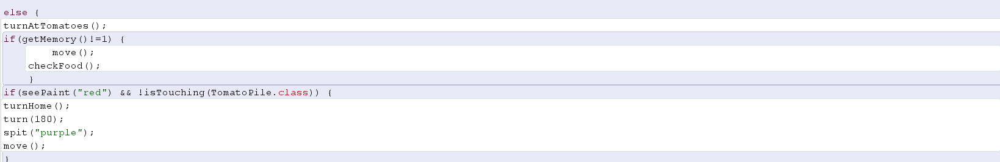

<h1 style="color:red;">Invasion der Greeps</h1>

<i>ein Projekt von Leif Peters und Linus Reck</i>

Das vorliegende Programm wurde mit Hilfe "<mark>Greenfoot's</mark>" geschrieben. Beim Bearbeiten orientierten wir uns an unseren Vorkenntnissen aus den Stride-Angaben und dem Greenfoot-Buch, sowie nutzten wir nun verstärkt das Internet, so z.B. zur Inspieration.

 Unser <a href="https://leynus.github.io/Stundenprotokoll/">Stundenprotokoll</a>
<h2>Inhaltsverzeichnis</h2>
<ul>
<li><a href="#anf">Anfänge</a></li>
<li><a href="#sdp">Über das Programm</a></li>
<li><a href="#adp">Ablauf der Programmierung</a></li>
<ul>
<li><a href="#era">Abprallen von den Wänden</a></li>
<li><a href="#nah">Abprallen vom Ozean</a></li>
<li><a href="#zas">Rote Farbkleckse</a></li>
<li><a href="#mus">Weitere Farbkleckse</a></li>
<li><a href="#evh">Anhalten an Tomatensträuchern</a></li>
</ul>
<li><a href="gre">Greep.class</a></li>
<li><a href="pfz">PLäne für die Zukunft</a></li>
</ul>

<h2 style="color:green;" id="anf">
Anfänge
</h2>

Unsere eigentliche Idee war es, mit einem RaspberryPi zu arbeiten. In den ersten Stunden probierten wir dies aus und installierten ein neues Betriebssystem auf einem dieser Computer. Da wir uns diese Arbeit allerdings anders vorgestellt hatten, hörten wir recht schnell mit diesem Projekt auf und ließen uns eine neue Idee einfallen. Unser Ziel war (und ist) es ein Doppelkopfspiel mit Greenfoot zu programmieren. Dafür müssten wir uns aber erstmal mit dem Programm und Programmierung allgemein auseinandersetzen. Wir begannen mit den Greenfoot-Stride Lernaktivitäten. Später haben wir auf Grundlage dieser, eigene Ideen in die Welt gebracht, woraus nach einer Zeit ein Spiel entstanden ist. In unserem neuesten Projekt wanden wir uns den "Greeps"zu. Diese Aliens landen mit einem Raumschiff, um Tomaten zu sammeln.

<h2 style="color:darkorchid;" id="sdp">
Über das Programm
</h2>

Bei dem Greeps-Szenario handelt es sich um einen älteren Programmierwettbewerb. Das Ziel des Wettbewerbes ist es, so viele Tomaten wie möglich in einer gewissen Zeit zum Raumschiff zu befördern. Zu Beginn des Programms landet das Raumschiff auf der Map und es treten dutzende Alien (sogenannte "Greeps") aus. Deren Aufgabe ist es Tomaten aufzunehmen und zum Schiff zu transportieren. Um einem Greep eine Tomate aufzuladen wird die Hilfe von einem anderen Greep benötigt. Es gibt insgesamt drei Maps, die von der Landschaft her verschieden sind. Am Ende werden die jeweiligen Punktzahlen zu einer Gesamtpunkzahl addiert. 
Am Anfang sind die Greeps völlig orientierungslos. Sinn dieses Programmierwettbewerbes ist es, die Greep.class so zu programmieren, dass die Actor miteinander kommunizieren können und in den verschiedensten Situationen die richtigen Befehle für ihr Handeln erhalten. 
Es gibt folgende Regeln in diesem Programmierwettbewerb:

<ul>
<li>Nur die Greep.class darf programmiert werden und die Greeps dürfen keine weiteren Klassen/Objekte erzeugen oder benutzen.</li>
<li>Es dürfen keine weiteren Instanzvariablen hinzugefügt werden.</li>
<li>Greeps dürfen nur indirekt über Farbkleckse kommunizieren.</li>
<li>Greeps haben ein kleines Sichtfeld / eine geringe Wahrnehmung (Ausnahme ist die Methode "turnHome(), mit der sich der Greep zum Schiff ausrichten kann.</li>
<li>Es sind nur Methoden aus der Oberklasse Creature.class und nicht aus der Greep.class erlaubt.</li>
<li>Ein Greep kann sich pro Runde nur einmal bewegen.</li>
</ul>

Weitere Informationen zu diesem Programierwettbewerb gibt es <a href="https://greenfootlernen.wikispaces.com/file/view/Greeps-Regeln.pdf">hier.</a>

<h2 style="color:indianred;" id="adp">
Ablauf der Programmierung
</h2>

<h3 style="color:darkturquoise;" id="era">
Abprallen von den Wänden
</h3>

Wenn die <a href="#gre">Greep.class</a> auf den Rand der World trifft, soll sie sich in einem Winkel drehen und sich danach geradeaus weiter bewegen. Dies war unser erster Schritt in diesem Projekt. Hierzu haben wie den Code <mark>“if(isatEdge()) {turn(); }”</mark> verwendet.

Um den bestmöglichen Winkel zu erhalten, haben wir später eine Messreihe durchgeführt. Dabei haben wir für alle 10° (von 10° bis 180°) jeweils fünf Durchläufe durchgeführt und dokumentiert. Für jeden Winkel haben wir den Mittelwert berechnet. Da es nur fünf Durchgänge waren und der Zufall im Greeps-Szenario auch eine große Auswirkung auf das Ergebnis hat, ist der Winkel mit dem höchsten Mittelwert nicht zwangsläufig der beste. Jedoch kann man sagen, dass dieser Winkel eine gute Grundlage für eine hohe Punktzahl ist.

Aus den Messwerten konnten wir entnehmen, dass ein Ausfallswinkel von 80° beim Eintreffen auf die Ränder der World(s) eine hohes Ergebnis verspricht.

<h3 style="color:darkturquoise;" id="nah">
Abprallen vom Ozean
</h3>

Nachdem die <a href="#gre">Greep.class</a> jetzt von der Grenze der World abprallt, soll er sich auch drehen und wegbewegen, wenn er auf den Ozean trifft. Dies haben wir mit dem Programmabschnitt <mark>“if(atWater()) { turn(); }”</mark> durchgeführt.

Im weiteren Verlauf unserer Arbeit haben wir bemerkt, dass der Ausfallswinkel bei Greeps, die mit einer Tomate beladen sind anders sein sollte, als der Winkel der Greeps, die “unbeladen” nach Tomaten suchen. Um erneut einen Winkel zu benutzen, bei dem das Ergebnis möglichst hoch ist, erstellten wir weitere Testreihen (wie bei “Abprallen von den Wänden”). 
Für die unbeladene <a href="#gre">Greep.class</a> erhielten wir folgende Ergebnisse für den Abprallwinkel vom Wasser:

Wir entschieden uns für einen Ausfallswinkel von 150°. Hierbei handelt es sich wieder um keinen perfekten Wert, jedoch einem guten Wert (aufgrund von einer nicht allzu umfangreichen Testreihe).

Auch für die Greeps, die eine Tomate tragen, führten wir einige Versuche durch und erlangten die maximale Ausbeute bei etwa (EINFÜGEN)°. Wir bemerkten schnell, dass die beladene <a href="#gre">Greep.class</a> trotz gutem Winkel lange braucht, um am Ozean vorbeizukommen. Wir bekamen die Idee, dass die <a href="#gre">Greep.class</a> auf ihrem Rückweg zur Ship.class bei Kontakt mit dem Ozean zunächst einige Schritte in eine andere Richtung gehen und sich danach erst neu ausrichten. Um diese Idee durchzusetzen benutzten wir das Gedächtnis der <a href="#gre">Greep.class</a>. In der Creature-Klasse ist ein Zähler integriert, der sich mithilfe von den Befehlen <mark>“getMemory”</mark> und <mark>“setMemory”</mark> kontrollieren lässt.

<ul>
<li>Wenn die <a href="#gre">Greep.class</a> eine Tomato.class trägt (mit Tomate beladen ist),</li>
<ul>
<li>wenn die <a href="#gre">Greep.class</a> die Ship.class berührt,</li>
<ul>
<li>wird der Zähler gleich Null gesetzt.</li>
</ul>
<li>wenn die <a href="#gre">Greep.class</a> die Ship.class nicht berührt,</li>
<ul>
<li>dreht sich die <a href="#gre">Greep.class</a> um 45°,</li>
<li>bewegt sich vorwärts,</li>
<li>und der Zähler wird auf 35 gesetzt.</li>
</ul>
<li>wenn der Zähler größer als 30 ist,</li>
<ul>
<li>bewegt sich die <a href="#gre">Greep.class</a> vorwärts,</li>
<li>und der Zähler zählt pro Schleife (Wiederholung) einen runter.</li>
</ul>
<li>wenn die <a href="#gre">Greep.class</a> das Wasser nicht berührt und sich der Zähler unter dem Wert 31 befindet,</li>
<ul>
<li>bewegt sich die <a href="#gre">Greep.class</a> vorwärts,</li>
<li>richtet sich die <a href="#gre">Greep.class</a> zum Schiff aus.</li>
</ul>
</ul>
</ul>

Wir erstellten eine eigene Methode (<mark>backup()</mark>)durch welche die <a href="#gre">Greep.class</a>, welche mit einer Tomate beladen ist, schneller zurück zur Schip.class gelangt, sodass insgesamt in der gleichen Zeit mehr Tomaten gesammelt werden können.

<h3 style="color:darkturquoise;" id="zas">
Rote Farbkleckse
</h3>

Eine Schwierigkeit des Greep-Szenarios ist es, die Greeps untereinander Informationen (z.B. Lage der Tomaten) austauschen zu lassen. In der Creature.class ist der Befehl <mark>“spit”</mark> definiert. Mit diesem Befehl kann die <a href="#gre">Greep.class</a> in bestimmten Situationen Farbkleckse hinterlassen. Mit dem Befehl <mark>“seePaint”</mark> können dann andere Actor der <a href="#gre">Greep.class</a> gewisse Aktionen ausfüllen, wenn sie diese Farbkleckse sehen. In diesem Projekt können die Greeps in drei verschiedenen Farben (rot, orange, lila) Farbkleckse auslegen.

Unsere Idee war es, dass die <a href="#gre">Greep.class</a>, wenn sie mit einer TomatoPile.class beladen ist, auf ihrem Rückweg zur Ship.class rote Farbkleckse legt. Der Weg zu mehreren Actors der TomatoPile.class (Tomatenstrauch) ist somit rot markiert. Um diese Idee durchzusetzen, benutzten wir folgenden Befehl:

Wenn die <a href="#gre">Greep.class</a> eine TomatoPile.class trägt, hinterlässt sie auf ihrem Weg rote Farbkleckse.

Wenn die anderen Actoren der Greep.class diese roten Farbkleckse sehen, sollen sie ihnen folgen und in die Richtung der Objekte der TomatoPile.class (Tomatenstäucher) gehen. Es gibt keinen Befehl, der der Greep.class befiehlt der Farbspur zu folgen. Jedoch kann sich ein Greep immer zur Ship.class ausrichten. 
Objekte der <a href="#gre">Greep.class</a>, die eine TomatoPile.class tragen, versuchen immer auf direktem Weg (geradlinig) zurück zum Schiff zu gelangen. Das bedeutet, dass die rote Farbspur oft größtenteils gerade verläuft (Ausnahme in Map 3). 
Das Sichtfeld eines einzelnen Actors der <a href="#gre">Greep.class</a> ist sehr klein. Das bedeutet, dass sich ein Objekt, welches einen Farbklecks sieht, sehr nahe an diesem Farbklecks ist (Es berührt ihn fast schon). 
Wir befiehlten dem Greep beim Erkennen der Farbkleckse sich zur Ship.class zu drehen und sich danach um 180° zu drehen (umzudrehen). Da der Actor sich zu diesem Zeitpunkt sehr nahe an der Farbspur befindet und diese oft sehr lange geradlinig verläuft, bewegt er sich oft parallel zur Farbspur in Richtung der Objekte der TomatoPile.class (Tomatensträucher).
Zur Wahrnehmung und Auswertung der roten Farbkleckse befiehlten wir der <a href="#gre">Greep.class</a> Folgendes:

 

<ul>
<li>Wenn der Actor der <a href="#gre">Greep.class</a> kein Objekt der TomatoPile.class trägt,</li>
<ul>
<li>wenn er rote Farbkleckse sieht und keinen Actor der TomatoPile.class berührt,</li>
<ul>
<li>richtet sich der Actor der <a href="#gre">Greep.class</a> zur Ship.class aus,</li>
<li>dreht sich um 180°,</li>
<li>und bewegt sich vorwärts.</li>
</ul>
</ul>
</ul>

<h3 style="color:darkturquoise;" id="mus">
Weitere Farbkleckse
</h3>

Wir versuchten mithilfe von weiteren Farbklecksen (orange und lila) den Greeps einen Informationsaustausch zu ermöglichen. Hierbei probierten wir den Actors der <a href="#gre">Greep.class</a> die Ränder des Wassers anzuzeigen. Wir benutzten folgenden Quelltextabschnitt dazu:

Wenn ein Greep das Wasser berührt, legt er orangene Farbkleckse.

Außerdem sollten Greeps, die gerade die roten Farbspur sehen und dieser folgen, dies durch lila Farbkleckse kennzeichnen.

<ul>
<li>Wenn der Actor der <a href="#gre">Greep.class</a> keine TomatoPile.class trägt,</li>
<ul>
<li>wenn er rote Farbkleckse sieht und keinen Actor der TomatoPile.class berührt,</li>
<ul>
<li>legt er lila Farbkleckse.</li>
</ul>
</ul>
</ul>

Mithilfe von diesen Informationen versuchten wir den Greeps die Ränder des Wassers vorzeitig zu kennzeichnen, sodass sie sich wegdrehen können, bevor sie aufs Wasser treffen. Die Greeps sollten sich aber nur vorzeitig drehen wenn sie keine rote oder lila Farbspur sehen (Sie sind nicht in der Nähe von einer Spur, die zu einem Tomatenhaufen führt) und wenn sie selbst keine Actor der TomatoPile.class berühren. Wir probierten folgenden Programmabschnitt aus:

<ul>
<li>Wenn der Actor der <a href="#gre">Greep.class</a> keinen Actor der TomatoPile.class trägt,</li>
<ul>
<li>wenn er orange Farbkleckse sieht, keine roten und blauen Farbspuren sieht und kein Objekt der TomatoPile.class berührt,</li>
<ul>
<li>dreht sich der Actor der <a href="#gre">Greep.class</a>.</li>
</ul>
</ul>
</ul>

Hierbei probierten wir verschiedene Drehwinkel aus. Eine Folge aus diesem Befehl war, dass sich Actor, die sich von der Wand wegdrehten, erneut drehten, weil sie ihre eigene Farbspur sahen. Wir probierten einen kleinen Drehwinkel aus, wodurch dieser Effekt schwächer wurde. Letztlich fiel unser endgültiges Ergebnis mit diesem Programmabschnitt kleiner aus, als ohne ihn. Deswegen entfernten wir diesen wieder. Wir glauben noch immer, dass sich diese Idee gut umsetzen lässt und mit einem richtig umgesetzten Befehl eine höhere Punktzahl erreichen kann. Jedoch hörten wir wegen Zeitdruck auf, weiter an der Umsetzung dieser Idee zu arbeiten.

<h3 style="color:darkturquoise;" id="evh">
Anhalten an Tomatensträuchern
</h3>

Die Greeps sind so programmiert, dass sie immer zu zweit an einem Actor der TomatoPile.class sein müssen, um diesen einem Greep “aufzuladen” und ihn zur Ship.class zu befördern. Wir dachten uns also, dass es sinnvoll wäre, wenn ein Objekt der <a href="#gre">Greep.class</a>, wenn es auf Actors der TomatoPile.class trifft anhält und auf andere Objekte der <a href="#gre">Greep.class</a> wartet. Dazu ließen wir die Greeps zunächst bei Berührung mit Objekten der TomatoPile.class anhalten. Es gibt keinen Befehl, der einen Greep direkt dazu bringt anzuhalten. Deshalb befiehlten wir der Greep.class sich nur zu bewegen, wenn sie keinen Actor der TomatoPile.class berührt (Ausnahme, wenn der Greep eine Tomate trägt).

<mark>if(!isTouching(TomatoPile.class)) { 
move(); }</mark>

Wenn ein Actor der <a href="#gre">Greep.class</a> kein Objekt der TomatoPile.class berührt, bewegt er sich vorwärts.

Daraus resultierte, dass die Greeps an den Tomatenhaufen stehen blieben. Jedoch stoppten sie am Rand der Sträucher bei Berührung des ersten Actors der TomatoPile.class. So stoppten an einem Tomatenhaufen teilweise vier Greeps an verschiedenen Ecken. An einem Strauch berührten also oft mehrere Greeps unterschiedliche Actor der TomatoPile.class, weswegen sie nicht miteinander interagieren konnten und keine Objekte zum Schiff transportieren konnten. 
Um dieses Problem zu beheben, sollte der Actor der <a href="#gre">Greep.class</a> nicht mehr am Rand des Tomatenhaufens stoppen, sondern in der Mitte. Dadurch würde er viele Objekte der TomatoPile.class gleichzeitig berühren und hätte eine gute Chance mit möglichst vielen anderen Actors der Greep.class zu interagieren. 
Um dies zu erreichen, ließen wir den Actor, wenn er das erste Objekt der TomatoPile.class berührt noch einige Schritte geradeaus weitergehen und dann erst anhalten. Dabei benutzten wir das Gedächtnis der <a href="#gre">Greep.class</a> (getMemory und setMemory), um der <a href="#gre">Greep.class</a> zu sagen, wieviele Schritte sie noch gehen muss.

<mark>if (!carryingTomato()) { 
	if(isTouching(TomatoPile.class)) { 
		if(getMemory()==0) { 
			setMemory (3); } 
		if(getMemory()>1) { 
			move(); 
      setMemory(getMemory() -1); } } }</mark>

<ul>
<li>Wenn ein Actor der <a href="#gre">Greep.class</a> keine Tomate trägt,</li>
<ul>
<li>wenn er einen Actor der TomatoPile.class berührt,</li>
<ul>
<li>wenn die Variable / der Zähler (Memory) Null beträgt,</li>
<ul>
<li>wird dieser Zähler (Memory) auf drei gesetzt.</li>
</ul>
<li>wenn der Wert der Variable (Memory) größer als eins ist,</li>
<ul>
<li>bewegt sich der Actor,</li>
<li>und die Variable (Memory) wird um eins subtrahiert.</li>
</ul>
</ul>
</ul>
</ul>

Das bedeutet, dass ein Greep beim Berühren einer Tomate zwei Schritte weiter geradeaus geht, bis seine Variable (Memory) genau eins beträgt und er anhält.

Diese Methode verbesserte das Problem, schuf es aber leider nicht aus der Welt. Wir variierten die Anzahl der Schritte. Leider gelang es nur denjenigen Greeps die Mitte des Strauches zu erreichen, die geradeaus auf die Mitte zugingen.

Wir bekamen die Idee, dass die Greeps sich beim Auftreffen auf den Tomatenhaufen kreisförmig bewegen und somit möglichst viele Tomaten fast zeitgleich (kurz hintereinander) berühren. 

Zur Umsetzung benutzten wir erneut das Gedächtnis (Memory) der Creature.class. Wir ließen den Greep bei Berühren des Tomatenstrauches wieder einige Schritte weiter gehen. Danach befahlen wir sich um 90° zu drehen und ein paar (gleich viele wie vorher) Schritte geradeaus zu gehen. Diesen Schritt wiederholten wir dreimal. Wenn der Actor der <a href="#gre">Greep.class</a> (an der Ausgangsposition) dann immer noch oder wieder ein Objekt der TomatoPile.class berührt wird der Vorgang wiederholt. Für diesen Befehl erstellten wir eine eigene Methode (<mark>turnAtTomatoes</mark>). Folgender Programmcode (Methode) codiert für diesen Befehl:

 

<ul>
<li>Wenn ein Actor der <a href="#gre">Greep.class</a> keine Tomate trägt,</li>
<ul>
<li>wenn er einen Actor der TomatoPile.class berührt,</li>
<ul>
<li>wenn die Variable (Memorie) null beträgt,</li>
<ul>
<li>wir die Variable (Memorie) auf 21 gesetzt.</li>
</ul>
</ul>
<li>Wenn der Wert der Variable (Memorie) 16 beträgt,</li>
<ul>
<li>dreht sich der Actor um 90°.</li>
</ul>
<li>wenn die Variable (Memorie) größer als 16 ist und der Actor ein Objekt der TomatoPile.class berührt,</li>
<ul>
<li>bewegt sich der Actor vorwärts,</li>
<li>und die Variable (Memorie) wird um 1 subtrahiert.
</ul>
<li>Wenn der Wert der Variable (Memorie) 11 beträgt,</li>
<ul>
<li>dreht sich der Actor um 90°.</li>
</ul>
<li>wenn die Variable (Memorie) größer als 11 ist,</li>
<ul>
<li>bewegt sich der Actor vorwärts,</li>
<li>und die Variable (Memorie) wird um 1 subtrahiert.</li>
</ul>
<li>Wenn der Wert der Variable (Memorie) 6 beträgt,</li>
<ul>
<li>dreht sich der Actor um 90°.</li>
</ul>
<li>wenn die Variable (Memorie) größer als 6 ist,</li>
<ul>
<li>bewegt sich der Actor vorwärts,</li>
<li>und die Variable (Memorie) wird um 1 subtrahiert.</li>
</ul>
<li>Wenn der Wert der Variable (Memorie) 1 beträgt,</li>
<ul>
<li>dreht sich der Actor um 90°,</li>
<li>und die Variable (Memorie) wird gleich null gesetzt.</li>
</ul>
</ul>
</ul>

Der Greep läuft also die Kanten eines Quadrates ab. Immer wenn er zurück am Ausgangspunkt ist wird erneut überprüft, ob er Actors der TomatoPile.class berührt. Ist dies der Fall läuft er ein weiteres Quadrat ab.

Mit dieser Methode konnten dem vorherigen Problem der vielen Greeps an einem Strauch entgegenwirken. Dadurch haben wir Ergebnisse erzielt, die deutlich höher ausfielen, als mit der alten Methode.

Mit allen Änderungen und Befehlen betrug unser maximales Ergebnis schließlich 100 Tomaten.

<h2 style="color:blue;" id="gre">
Greep.class
</h2>

<ul>
<li>Wenn der Greep eine Tomate trägt,</li>
<ul>
<li>legt er eine rote Farbspur.</li>
<li>wenn er am Schiff ist,</li>
<ul>
<li>lässt er die Tomate fallen,</li>
<li>dreht sich um 180°,</li>
<li>und setzt die Variable (Memory) gleich null.</li>
</ul>
<li>wenn er nicht am Schiff ist,</li>
<ul>
<li>dreht er sich bei Berührung mit dem Wasser um 45°, läuft einige Schritte und dreht sich dann wieder dem Schiff zu.</li>
</ul>
</ul>
<li>Wenn der Greep keine Tomate trägt,</li>
<ul>
<li>und Actors der TomatoPile.class berührt, läuft er solange im Quadrat, bis er keinen Actor dieser Klasse mehr berührt.</li>
<li>wenn die Variable (Memory) ungleich eins ist,</li>
<ul>
<li>bewegt sich der Actor,</li>
<li>und hält Ausschau nach Objekten der TomatoPile.class.</li>
</ul>
<li>wenn er rote Farbkleckse sieht und keinen Actor der TomatoPile.class berührt,</li>
<ul>
<li>dreht er sich zum Schiff,</li>
<li>dreht sich um 180°</li>
<li>legt lila Farbkleckse,</li>
<li>und bewegt sich.</li>
</ul>
<li>wenn er das Wasser berührt,</li>
<ul>
<li>dreht sich der Actor um 150°</li>
<li>und legt orangene Farbkleckse.</li>
</ul>
</ul>
<li>Wenn der Greep den Rand der World erreicht,</li>
<ul>
<li>dreht er sich um 80°</li>
</ul>
</ul>

<h2 style="color:lime;" id="pfz">
Pläne für die Zukunft
</h2>

Da uns die"Greeps" eine Herausforderung an unsere bisherigen Kenntnisse sind, ist es unser Ziel weiter an diesem Programm und in dieser optimierungsorientierten Weise zu arbeiten.

